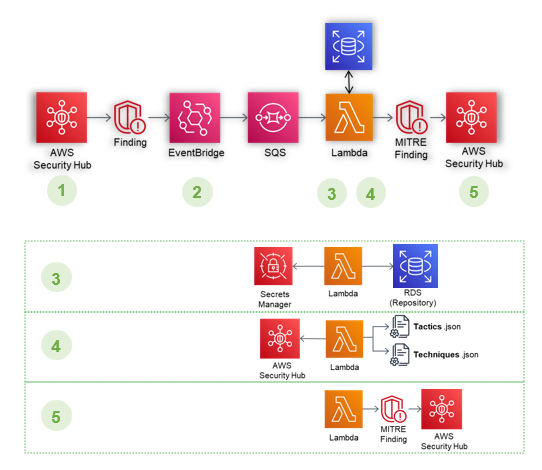
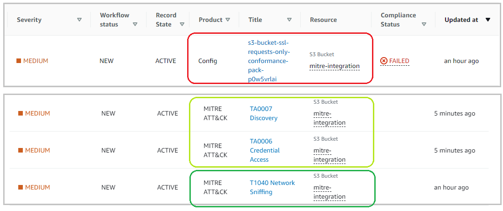
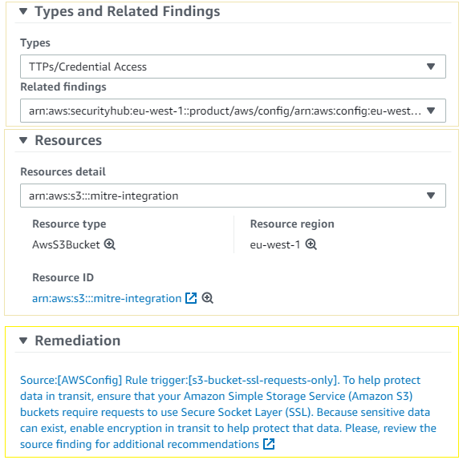

# Virtual SOC with MITRE Attack integration with AWS Security Hub example

## Overview

In this solution, we will show how you can retrieve valuable alerts from native AWS services, which have been centralised in Security Hub, to enrich them with information regarding tactics and techniques from [MITRE ATT&CK](https://attack.mitre.org/matrices/enterprise/cloud/), giving you a broad view of attack vectors to which your environment might be exposed. This solution is compatible with multi-account environments and AWS Organisations.

-   [**Project details**](docs/project_eng.md)
-   [**Repository details**](docs/repository_eng.md)
-   [**Conformance pack details**](docs/MITRE%20ConformancePack%20Services%20and%20Rules%20List.md)
-   [**Security Hub integration details**](docs/securityhub-integration_eng.md)
-   [**Mapped Standard controls summary**](docs/database-mapping.md)
-   [**Deployment steps**](docs/deployment_eng.md)
-   [**Self-remediation module**](selfremediation/README.md)

## Requirements

Although this solution can be deployed independently (in isolated accounts) it has been designed to comply with the AWS reference architecture. Its best performance occurs when deployed in centralised security accounts (those designated to centralise the management of AWS Security Hub, AWS Config and Amazon GuardDuty services).

If the following services are not already in use you can enable them during the deployment process:
- The solution is supported on Security Hub.
- The solution is supported by AWS Config. 
- It is highly recommended (but not required) to enable the GuardDuty service.

The following network resources must be available to support the deployment:
- At least two sub-networks (we recommend PRIVATE type) in different availability zones, for the deployment of the RDS repository.
- At least two sub-networks (we recommend PRIVATE type) in different availability zones, for the deployment of VPC Lambda, which shall have connectivity to the RDS.

## This is how the solution works

1.	The originating service generates a new discovery in Security Hub.
2.	A CloudWatch EventBridge rule captures valid findings and sends them to an SQS queue.
3.	The Lambda function is invoked. It connects to the repository in RDS and, based on the "rule/event" that triggered the original find, retrieves related information on techniques, tactics, security standards and other details.
4.	The Lambda function prepares new enriched findings, corresponding to each technique and tactic retrieved.
5.	Finally, the new findings are published in the Security Hub.

## This is how the final result looks like

Depending on the information mapped and recorded in the database, one or more techniques will correspond to each security rule (or event) recorded, and at least one tactic. This generates new MITRE ATT&CK findings in Security Hub. 

In addition to maintaining the details of the original finding and making reference to it by means of a link, information concerning the technique shall be added.

