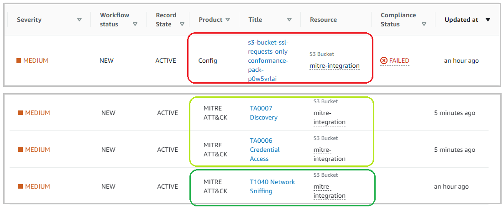
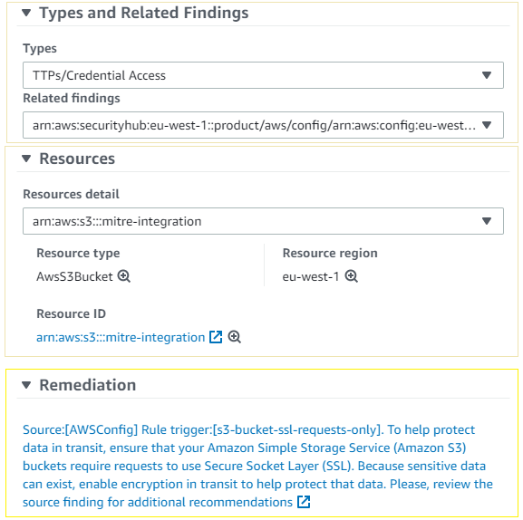

# Ejemplo de Virtual SOC que integra MITRE Attack en AWS Security Hub

## Visión global

En esta solución, mostraremos cómo puede recuperar alertas de valor provenientes de servicios nativos de AWS, que han sido centralizadas en Security Hub, para enriquecerlas con información referente a tácticas y técnicas de [MITRE ATT&CK](https://attack.mitre.org/matrices/enterprise/cloud/), dando así una amplia visión de vectores de ataque a los que pudiera estar expuesto su entorno. Esta solución es compatible con entornos multi-cuenta y AWS Organizations.

-   [**Detalles del proyecto**](docs/project_esp.md)
-   [**Detalles del repositorio**](docs/repository_esp.md)
-   [**Detalles del Paquete de Conformidad**](docs/MITRE%20ConformancePack%20Services%20and%20Rules%20List.md)
-   [**Detalles de la integración en Security Hub**](docs/securityhub-integration_esp.md)
-   [**Sumario de controles mapeados**](docs/database-mapping.md)
-   [**Pasos de despliegue**](docs/deployment_esp.md)
-   [**Módulo de auto-remediación**](selfremediation/README_esp.md)

## Requisitos

Aunque esta solución puede ser desplegada de manera independiente (en cuentas aisladas) ha sido diseñada cumpliendo con la arquitectura de referencia de AWS. Su mejor desempeño ocurre al desplegar en cuentas centralizadas de seguridad (aquellas designadas para centralizar la administración de servicios AWS Security Hub, AWS Config y Amazon GuardDuty).

Si los siguientes servicios no están ya en uso podrá habilitarlos durante el proceso de despliegue:
- La solución se sustenta en Security Hub.
- La solución se sustenta en AWS Config. 
- Es muy recomendable (pero no necesario) habilitar el ervicio GuardDuty.

Deberá disponer de los siguientes recursos de red para sustentar el despliegue:
- Al menos dos subredes (recomendamos del tipo PRIVADAS) en distintas zonas de disponibilidad, para el despliegue del repositorio RDS.
- Al menos dos subredes (recomendamos del tipo PRIVADAS) en distintas zonas de disponibilidad, para el despliegue de VPC Lambda, que deberá tener conectividad con la RDS.

## Así es como la solución funciona

1.	El servicio de origen genera un nuevo hallazgo en Security Hub.
2.	Una regla de CloudWatch EventBridge captura los hallazgos válidos y los envía a una cola SQS.
3.	La función Lambda es invocada. Conecta con el repositorio en RDS y, en función de la "regla/evento" que disparó el hallazgo original, recupera información relacionada de técnicas, tácticas, estándares de seguridad y otros detalles.
4.	La función Lambda prepara los nuevos hallazgos enriquecidos, correspondientes a cada técnica y táctica recuperadas.
5.	Finalmente, los nuevos hallazgos son publicados en Security Hub.

## Así es como se muestra el resultado final

En función de la información mapeada y registrada en la base de datos, corresponderá una o varias técnicas con cada regla (o evento) de seguridad registrado, y mínimo una táctica. Esto genera nuevos hallazgos MITRE ATT&CK en Security Hub. 

Además de mantener los datos del hallazgo de origen y hacer referencia a él mediante un enlace, se añadirá información referente a la técnica.

