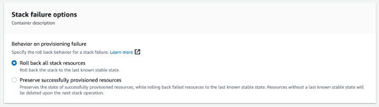

## Deployment and Configuration

## Previous

For the deployment of the database in RDS you will require the arn of a valid backup. You can have the latest version of the *public* backup:
```
arn:aws:rds:eu-west-1:794731801658:snapshot:vsoc-mitre-integration-repository-v20230119
```
*We recommend* that you generate your own *encrypted backup* from this public copy, so that during deployment, encryption is configured on the RDS instance (this step cannot be done later).

1. In your AWS account console, open the **Amazon RDS** service. Access the *Snapshots from* section.
2. Locate the public snapshot listed above. *Mark* it and select the *Copy Snapshot* action.
3. Select the region where you are going to deploy, provide a new flag, *check* the *Copy tags* option.
4. *Check* enable encryption. In the drop-down select one of your CMK keys to perform the encryption of the future RDS.

These steps will generate a new encrypted snapshot from the public snapshot.

Also, you need the **psycopg2** Python Library for AWS Lambda layer deployed in your lambda environment. [You can follow this link in order to compile and deploy it](https://github.com/jkehler/awslambda-psycopg2).

## Deployment steps

1.  Download as Zip the lambda's python code files from **python** folder for future use in CloudFormation. Download the CloudFormation template set from the [**templates**](../templates) folder.

2.  Copy the files **to an S3 bucket in the target account** and the same region where it will be deployed.

3.  In your AWS account console, open the **CloudFormation** service. Click **Create Stack** with new resources.

4.  Enter the URL of the S3 object **vsoc-mitreintsh-main.yml** in the Amazon S3 URL field under the Specify template section.

5.  Click **Next**. On the next page, enter a name for the stack.

6.  On the same page, assign valid values for the **input parameters** (see below).

7.  Click on **Next**.

8.  Accept all default options on the screens below. Tap **Next**.

9.  **Check** I confirm that AWS CloudFormation may create IAM resources with custom names and I confirm that AWS CloudFormation may require the following capability: CAPABILITY_AUTO_EXPAND. Click **Submit**.

Deployment may take some time.

## Parameters

The solution consists of a main stack and up to 8 nested stacks. Critical parameters are entered in the deployment of the main stack **vsoc-mitreintsh-main.yml** and are propagated to the secondary stacks during deployment. All other parameters have *default* values in the secondary stacks.

### Main
- The values in the **Ownership** parameters correspond to labels that will be propagated to the nested templates. They serve to identify the deployed resources.
- In **Folders**, you must indicate the URL and the name of the S3 bucket (plus folders, if any) where you have saved the templates and zip files for the deployment.
- Under **Protection**, you will be given the option to enable AWS Config. If you already have the service you can skip this step by leaving the value set to **false**. Otherwise, during deployment AWS Config will be enabled with minimum default configuration.
- Under **Detection**, you will be given the option to enable Security Hub and GuardDuty. If you already have these services you can skip this step. Otherwise, during deployment they will be enabled with the minimum default configuration. In any case, GuardDuty is an optional (but highly recommended) service.
- In **Network Configuration**, you must choose a valid VPC for resource deployment. In the RDS and Lambda fields, you must indicate valid subnets:
    1.  It is recommended that they are subnets without public access.
    2.  From the designated subnets to VPC Lambda shall allow connectivity up to the RDS.
    3.  For both cases, the data has to be entered in the box as a string of identifiers separated by comma "," without spaces: *subnet-0ffb6f87xxxxx,subnet-0c023eb98yyyyy*
- In **RDS Configuration**, you must indicate the arn of the database backup you wish to use: either the *public* backup or the *encrypted copy* you have previously generated.
- In **Language**, you must choose language for the output data: spanish(**esp**) or english(**eng**).

### RDS Stack

For modifications only:
- In **RDS Network Configuration**, the VPC parameters and subnets of the main stack shall have been retrieved.
- In **Snapshot ARN** it indicates the arn of the *retrieval snapshot*. Data retrieved from the main stack.
- In **Instance Type** the instance size is defined. We recommend small machines due to their low power consumption. Default *db.t4g.micro* .
- The **Backup Retention Period** will indicate the backup retention period. Default *7 days*. Since public snapshot is available, if you are not going to make adjustments/additions to your repository, you can disable backups by moving this value to 0.
- You can adjust the backup periods in the **Preferred Backup Window** and **Preferred Maintenance Window**.
- You can enable backup on delete in **Snapshot On Delete**, recommended if you make modifications to the repository.
- In **TCP Port** you can designate a different port for the Postgres protocol. Default *TCP 5432*.

### ConformancePack Stack

For adjustments to compliance rules:
-   **AccessKeysRotatedParamMaxAccessKeyAge** indicates the maximum number of days allowed without AccessKey rotation of IAM users. Default *90 days*.
-   **AcmCertificateExpirationCheckParamDaysToExpiration** indicates the minimum number of days of pre-notification before expiry of certificates. Default *90 days*.
-   **CloudwatchAlarmActionCheckParamAlarmActionRequired** checks for the existence of the *AlarmAction* parameter in Cloudwatch alarms. Allowed values TRUE | FALSE . Default *TRUE*.
-   **CloudwatchAlarmActionCheckParamInsufficientDataActionRequired** checks for the existence of the *InsufficientDataAction* parameter in Cloudwatch alarms. Allowed values TRUE | FALSE . Default *TRUE*.
-   **CloudwatchAlarmActionCheckParamOkActionRequired** checks for the existence of the *OkAction* parameter in Cloudwatch alarms. Allowed values TRUE | FALSE . Default *FALSE*.
-   **ElbPredefinedSecurityPolicySslCheckParamPredefinedPolicyName** checks the *default TLS policy* of balancers. Default *ELBSecurityPolicy-TLS-1-2-2017-01*.
-   **IamPasswordPolicyParamMaxPasswordAge** sets the maximum age of IAM passwords. Default *365 days*.
-   **IamPasswordPolicyParamMinimumPasswordLength** sets the minimum length of IAM passwords. Default *14*.
-   **IamPasswordPolicyParamPasswordReusePrevention** sets the minimum number of password changes prior to allowing IAM password reuse. Default *24 days*.
-   **IamPasswordPolicyParamRequireLowercaseCharacters** requires the use of lower case in IAM passwords. Allowed values true | false. Default *true*.
-   **IamPasswordPolicyParamRequireNumbers** requires the use of numbers in IAM passwords. Allowed values true | false. Default *true*.
-   **IamPasswordPolicyParamRequireSymbols** requires the use of symbols in IAM passwords. Allowed values true | false. Default *true*.
-   **IamPasswordPolicyParamRequireUppercaseCharacters** requires the use of upper case letters in IAM passwords. Allowed values true | false. Default *true*.
-   **IamUserUnusedCredentialsCheckParamMaxCredentialUsageAge** sets the maximum period for unused credentials in IAM. Default *45 days*.
-   **RedshiftClusterConfigurationCheckParamClusterDbEncrypted** checks the encryption on Redshift. Allowed values TRUE | FALSE. Default *TRUE*.
-   **RedshiftClusterConfigurationCheckParamLoggingEnabled** checks the generation of records in Redshift. Allowed values TRUE | FALSE. Default *TRUE*.
-   **RedshiftClusterMaintenancesettingsCheckParamAllowVersionUpgrade** checks Redshift version update enablement. Allowed values true | false. Default *true*.
-   **RestrictedIncomingTrafficParamBlockedPort** allows you to define up to 5 TCP ports with restricted access. Default values *20,21,3389,3306,4333*.
-   **S3AccountLevelPublicAccessBlocksPeriodicParamBlockPublicAcls** checks that the *BlockPublicAcls* parameter is enabled. Allowed values True | False. Default *True*.
-   **S3AccountLevelPublicAccessBlocksPeriodicParamBlockPublicPolicy** checks that the *BlockPublicPolicy* parameter is enabled. Allowed values True | False. Default *True*.
-   **S3AccountLevelPublicAccessBlocksPeriodicParamIgnorePublicAcls** checks that the *IgnorePublicAcls* parameter is enabled. Allowed values True | False. Default *True*.
-   **S3AccountLevelPublicAccessBlocksPeriodicParamRestrictPublicBuckets** checks that the *RestrictPublicBuckets* parameter is enabled. Allowed values True | False. Default *True*.
-   **VpcSgOpenOnlyToAuthorizedPortsParamAuthorizedTcpPorts** allows you to define unrestricted port. By default *TCP 443*.

## Upgrade

### Previous steps

To make important updates to the project or updates in secondary stacks, it will be necessary to previously enable the *rollback mode* in the **main stack**.

1.  In your AWS account console, open the **CloudFormation** service. Select the primary stack and click **Update**.

2.  Keep the values ​​to *Use Current Stack*. Click **Next**.

3.  Do not change parameter values ​​at this time. Click **Next**.

4.  Under *Stack Failure Options* select **Roll back all stack resources**. Click **Next**.

    

5.  Review the changes. **Check** the required confirmations. Press **Submit**.

6.  You can now proceed to make the desired updates to secondary stacks in **CloudFormation**.

7.  Once you're done, you'll need to repeat the previous steps on the **main stack** to restore the **Preserve successfully provisioned resources** option.

To perform a repository version upgrade, you will need to manually disable RDS deletion protection.

1.  In your AWS account console, open the **Amazon RDS** service. Select the database and click **Modify**.

2.  Look for and **uncheck** deletion protection. Click **Next**.

3.  Check the option to apply changes immediately. Press **Finish**.

With these modifications applied, you can proceed with the update from the **main stack** in **CloudFormation**.

### Modifications on nested stacks

To modify parameters in the secondary stacks:

1.  In your AWS account console, open the **CloudFormation** service. Select the stack and click **Upgrade**.

2.  In the pop-up window **check** Refresh Nested Stack and click **Upgrade Stack**.

3.  Keep the values under Use Current Stack. Press **Next**.

4.  In this section you can modify the **parameters** to your needs. Press **Next** when finished.

8.  Accept all the default options in the screens below. Click **Next**.

9.  Review the changes. **Check** the necessary confirmations. Click **Send**.

### Repository

In the first instance the repository database maintains default values for the administrator and the lambda user. It is recommended practice that you change the password for these profiles.
```
Default values:
Database: vsocmitreintegrationdatabase

Administrator
user: mirmaster
password: admin12345

Reading
user: mirlambdareader
password: reader12345
```

To make these changes you will need to access the database through a SQL client with an administrator profile **mirmaster** Remember that the database will be isolated:
- You will need to connect via a jump instance or allow external connectivity during the process.
- You will need a PostgreSQL 14.4 compatible client.

Follow the recommended steps of your PostgreSQL client for connection and modifications. An example:
```
Via commands:
Connection (using psql):
    $ psql -h <RDS-endpoint> -p <port> -U mirmaster -d vsocmitreintegrationdatabase

User modification:
    ALTER USER <uder> WITH PASSWORD '<new password>';

```
Remember to modify the **vsoc-mitreintsh-rds-reader-secret** with the new credentials for the Lambda function.
