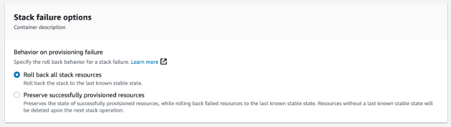

# Despliegue y Configuración

## Previo

Para el despliegue de la base de datos en RDS requerirá el arn de una copia de seguridad válida. Puede disponer de la última versión de la copia de seguridad *pública*:
```
arn:aws:rds:eu-west-1:794731801658:snapshot:vsoc-mitre-integration-repository-v20230119
```
*Recomendamos* que genere su propia *copia de seguridad cifrada* a partir de esta copia pública, para que durante el despliegue se configure el cifreado en la instancia RDS (este paso no podrá realizarse con posterioridad).

1. En la consola de su cuenta de AWS, abra el servicio **Amazon RDS**. Acceda a la sección de *Instantáneas de*.
2. Localice la instantánea pública arriba indicada. *Márquela* y seleccione la acción *Copiar instantánea*.
3. Seleccione la región en la que vaya a ralizar el despliegue, proporcione un nuevo indicador, *marque* la opción *Copiar etiquetas*.
4. *Marque* habilitar cifrado. En el desplegable seleccione una de sus claves CMK para realizar el cifrado de la futura RDS.

Con estos pasos generará una nueva instantánea cifrada a partir de la instantánea pública.

Adicionalmente, es necesario disponer de la Librería Python **psycopg2** para capas de AWS Lambda desplegado en su entorno. [Puede compilar y desplegar la librería siguiendo este enlace](https://github.com/jkehler/awslambda-psycopg2).

## Pasos de despliegue

1.  Descargue como Zip los ficheros python de Lambda de la carpeta **python** para su futuro uso en CloudFormation. Descargue el conjunto de plantillas CloudFormation de la carpeta [**templates**](../templates).

2.  Copie los ficheros **a un bucket S3 en la cuenta de destino** y misma región en que se va a desplegar.

3.  En la consola de su cuenta de AWS, abra el servicio **CloudFormation**. Pulse en **Crear pila** con recursos nuevos.

4.  Introduzca la URL del objeto S3 **vsoc-mitreintsh-main.yml** en el campo URL de Amazon S3 bajo la sección Especificar plantilla.

5.  Pulse en **Siguiente**. En la siguiente página, introduzca un nombre para la pila.

6.  En la misma página, asigne valores válidos para los **parámetros** de entrada (ver más abajo).

7.  Pulse en **Siguiente**.

8.  Acepte todas las opciones por defecto en las pantallas de a continuación. Pulse en **Siguiente**.

9.  **Marque** Confirmo que AWS CloudFormation podría crear recursos de IAM con nombres personalizados y Confirmo que AWS CloudFormation podría requerir la siguiente capacidad: CAPABILITY_AUTO_EXPAND. Pulse **Enviar**.

El despliegue puede llevar algún tiempo.

## Parámetros

La solución se compone de una pila principal y de hasta 8 pilas anidadas. Los parámetros críticos son introducidos en el despliegue de la pila principal **vsoc-mitreintsh-main.yml** y son propagados a las secundarias durante el despliegue. El resto de parámetros tienen valores *por defecto* en las pilas secundarias.

### Principal
-   Los valores en los parámetros de **Ownership** (Propiedad) corresponden a etiquetas que se propagarán a las plantillas anidadas. Sirven para identificar los recursos desplegados.
-   En **Folders** (Carpetas), deberá indicar la URL y el nombre del bucket S3 (más carpetas, de existir) en dónde haya guardado las plantillas y ficheros zip para el despliegue.
-   Dentro de **Protection** (Protección), se le dará la opción de habilitar AWS Config. Si ya dispone del servicio puede omitir este paso dejando el valor en **false**. De lo contrario, durante el despliegue se habilitará AWS Config con configuración mínima por defecto.
-   Dentro de **Detection** (Detección), se le dará la opción de habilitar Security Hub y GuardDuty. Si ya dispone de estos servicios puede omitir este paso. De lo contrario, durante el despliegue se habilitarán con la configuración mínima por defecto. En cualquier caso, GuardDuty es un servicio opcional (pero altamente recomendado).
- En **Network Configuration** (Configuración de Red), deberá escoger una VPC válida par el despliegue de recursos. En los campos correspondientes a RDS y Lambda deberá indicar subredes válidas:
    1.  Es recomendado que sean subredes sin acceso público.
    2.  Desde las subredes designadas a VPC Lambda deberá permitir connectividad hasta la RDS.
    3.  Para ambos casos, el dato ha de introducirse en la casilla como una cadena de identificadores separados por coma "," sin espacios: *subnet-0ffb6f87xxxxx,subnet-0c023eb98yyyyy*
- En **RDS Configuration** (Configuración de RDS), deberá indicar el arn de la copia de seguridad de la base de datos que desée emplear: bien la copia de seguridad *pública* o la *copia cifrada* que haya generado previamente.
- En **Language** (Idioma), podrá elegir el idioma de la salida de datos entre los disponibles: actualmente español(**esp**) e inglés(**eng**).

### Pila RDS

Sólo para modificaciones:
-   En **RDS Network Configuration** (Configuración de Red para RDS), se habrán recuperado los parámetros de VPC y subredes de la pila principal.
-   En **Snapshot ARN** indica el arn de la *instantánea de recuperación*. Dato recuperado de la pila principal.
-   En **Instance Type** se define el tamaño de instancia. Recomendamos máquinas pequeñas debido a su bajo consumo. Por defecto *db.t4g.micro* .
-   En **Backup Retention Period** indicará el periodo de retención de copias de seguridad. Por defecto *7 días*. Ya que se dispone de snapshot pública, si no va a realizar ajustes/añadidos en su repositorio, puede deshabilitar las copias de seguridad moviendo este valor a 0.
-   Puede ajustar los periodos de copia de seguridad en **Preferred Backup Window** y **Preferred Maintenance Window**.
-   Puede habilitar la copia de seguridad al borrado en **Snapshot On Delete?**, recomendado si realiza modificaciones en el repositorio.
-   En **TCP Port** puede designar un puerto distinto para el protocolo Postgres. Por defecto *TCP 5432*.

### Pila ConformancePack

Para ajustes en las reglas de conformidad:
-   **AccessKeysRotatedParamMaxAccessKeyAge** indica el máximo número de días admitidos sin rotación de AccessKey de usuarios IAM. Por defecto *90 días*.
-   **AcmCertificateExpirationCheckParamDaysToExpiration** indica el mínio número de días de pre aviso antes de caducidad de certificados. Por defecto *90 días*.
-   **CloudwatchAlarmActionCheckParamAlarmActionRequired** comprueba la existencia del parámetro *AlarmAction* en alarmas Cloudwatch. Valores admitidos TRUE | FALSE . Por defecto *TRUE*.
-   **CloudwatchAlarmActionCheckParamInsufficientDataActionRequired** comprueba la existencia del parámetro *InsufficientDataAction* en alarmas Cloudwatch. Valores admitidos TRUE | FALSE . Por defecto *TRUE*.
-   **CloudwatchAlarmActionCheckParamOkActionRequired** comprueba la existencia del parámetro *OkAction* en alarmas Cloudwatch. Valores admitidos TRUE | FALSE . Por defecto *FALSE*.
-   **ElbPredefinedSecurityPolicySslCheckParamPredefinedPolicyName** comprueba la *política TLS por defecto* de balanceadores. Por defecto *ELBSecurityPolicy-TLS-1-2-2017-01*.
-   **IamPasswordPolicyParamMaxPasswordAge** establece la antigüedad máxima de contraseñas IAM. Por defecto *365 días*.
-   **IamPasswordPolicyParamMinimumPasswordLength** establece la longitud mínima de contraseñas IAM. Por defecto *14*.
-   **IamPasswordPolicyParamPasswordReusePrevention** establece el número mínimo de cambio de contraseña previos a permitir reutilización de contraseña IAM. Por defecto *24 días*.
-   **IamPasswordPolicyParamRequireLowercaseCharacters** exige el uso de minúsculas en contraseñas IAM. Valores permitidos true | false. Por defecto *true*.
-   **IamPasswordPolicyParamRequireNumbers** exige el uso de números en contraseñas IAM. Valores permitidos true | false. Por defecto *true*.
-   **IamPasswordPolicyParamRequireSymbols** exige el uso de símbolos en contraseñas IAM. Valores permitidos true | false. Por defecto *true*.
-   **IamPasswordPolicyParamRequireUppercaseCharacters** exige el uso de mayúsculas en contraseñas IAM. Valores permitidos true | false. Por defecto *true*.
-   **IamUserUnusedCredentialsCheckParamMaxCredentialUsageAge** establece el periodo máximo para credenciales sin uso en IAM. Por defecto *45 días*.
-   **RedshiftClusterConfigurationCheckParamClusterDbEncrypted** comprueba el cifrado en Redshift. Valores permitidos TRUE | FALSE. Por defecto *TRUE*.
-   **RedshiftClusterConfigurationCheckParamLoggingEnabled** comprueba la generación de registros en Redshift. Valores permitidos TRUE | FALSE. Por defecto *TRUE*.
-   **RedshiftClusterMaintenancesettingsCheckParamAllowVersionUpgrade** comprueba la habilitación de actualización de versiones en Redshift. Valores permitidos true | false. Por defecto *true*.
-   **RestrictedIncomingTrafficParamBlockedPort** permite definir hasta 5 puertos TCP con acceso restringido. Valores por defecto *20,21,3389,3306,4333*.
-   **S3AccountLevelPublicAccessBlocksPeriodicParamBlockPublicAcls** comprueba que esté habilitado el parámetro *BlockPublicAcls*. Valores permitidos True | False. Por defecto *True*.
-   **S3AccountLevelPublicAccessBlocksPeriodicParamBlockPublicPolicy** comprueba que esté habilitado el parámetro *BlockPublicPolicy*. Valores permitidos True | False. Por defecto *True*.
-   **S3AccountLevelPublicAccessBlocksPeriodicParamIgnorePublicAcls** comprueba que esté habilitado el parámetro *IgnorePublicAcls*. Valores permitidos True | False. Por defecto *True*.
-   **S3AccountLevelPublicAccessBlocksPeriodicParamRestrictPublicBuckets** comprueba que esté habilitado el parámetro *RestrictPublicBuckets*. Valores permitidos True | False. Por defecto *True*.
-   **VpcSgOpenOnlyToAuthorizedPortsParamAuthorizedTcpPorts** permite definir puerto no restringido. Por defecto *TCP 443*.

## Actualización

### Pasos previos

Para realizar actualizaciones importantes del proyecto o ajustes en pilas secundarias será necesario previamente habilitar el *modo restauración* en la **pila principal**.

1.  En la consola de su cuenta de AWS, abra el servicio **CloudFormation**. Seleccione la pila principal y pulse **Actualizar**.

2.  Mantenga los valores en *Utilizar la pila actual*. Pulse **Siguiente**.

3.  No cambie valores de parámetros en esta ocasión. Pulse **Siguiente**.

4.  En *Opciones de error de la pila* seleccione **Restaurar todos los recursos de la pila**. Pulse **Siguiente**.

    

5.  Revise los cambios. **Marque** las confirmaciones necesarias. Pulse **Enviar**.

6.  Ya puede proceder a realizar las modificaciones deseadas de pilas secundarias a través de **CloudFormation**.

7.  Una vez haya finalizado, deberá repetir los pasos previos en la **pila principal** para restaurar la opción de **Conservar los recursos aprovisionados correctamente**.

Para realizar actualización de versión de repositorio, será necesario deshabilitar manualmente la protección contra eliminaciones de la RDS.

1.  En la consola de su cuenta de AWS, abra el servicio **Amazon RDS**. Seleccione la base de datos y pulse **Modificar**.

2.  Al final de las opciones, **desmarque** la protección contra eliminaciones. Pulse **Siguiente**.

3.  Marque la opción de aplicar cambios inmediatamente. Pulser **Finalizar**.

Aplicadas estas modificaciones, podrá proceder con la actualización desde la **pila principal** en **CloudFormation**.

### Ajustes en pilas secundarias

Para modificar parámetros en las pilas secundarias:

1.  En la consola de su cuenta de AWS, abra el servicio **CloudFormation**. Seleccione la pila y pulse **Actualizar**.

2.  En la ventana emergente **marque** Actualizar la pila anidada y pulse **Actualizar pila**.

3.  Mantenga los valores en Utilizar la pila actual. Pulse **Siguiente**.

4.  En esta sección podrá modificar los **parámetros** a sus necesidades. Pulse **Siguiente** al finalizar.

8.  Acepte todas las opciones por defecto en las pantallas de a continuación. Pulse en **Siguiente**.

9.  Revise los cambios. **Marque** las confirmaciones necesarias. Pulse **Enviar**.

### Repositorio

En un primer momento, la base de datos del repositorio mantiene valores por defecto para el administrador y el usuario de lambda. Es práctica recomendada que modifique la contraseña para estos perfiles.
```
Valores por defecto:
Base de datos: vsocmitreintegrationdatabase

Administrador
user: mirmaster
password: admin12345

Lectura
user: mirlambdareader
password: reader12345
```

Para realizar estos cambios deberá acceder a la base de datos a través de un cliente SQL con perfil de administrador **mirmaster** Recuerde que la base de datos estará aislada:
-   Deberá conectar a través de una instancia de salto o permitir conectividad externa durante el proceso.
-   Necesitará un cliente compatible con PostgreSQL 14.4.

Siga los pasos recomendados de su cliente PostgreSQL para la conexión y las modificaciones. Un ejemplo:
```
Mediante comandos:
Conexión (empleando psql):
    $ psql -h <RDS-endpoint> -p <puerto> -U mirmaster -d vsocmitreintegrationdatabase

Modificación de usuario:
    ALTER USER <usuario> WITH PASSWORD '<nueva contraseña>';

```
Recuerde modificar el secreto **vsoc-mitreintsh-rds-reader-secret** con las nuevas credenciales para la función Lambda.
