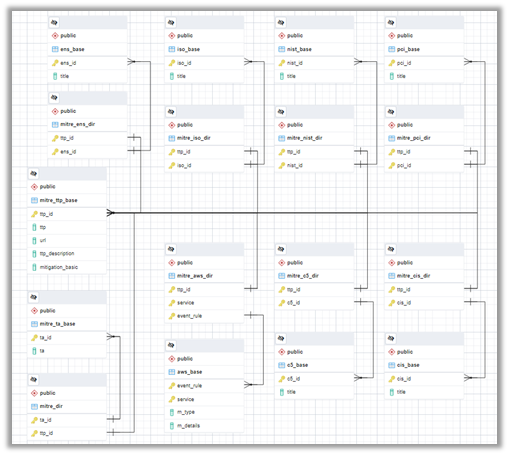

## Database

The solution is designed so that in multi-account or Organisational environments, only **deployment in the account designated for security** (the one that centralises the management of SecurityHub and Config) is necessary. We have chosen to use a *db.t4g.micro* instance of RDS with *Postgresql 14.4* engine, in Multi-az. Remaining open to adjustments throughout the life of the project. The amount of data and the number of operations (*limited) allows the use of machines with low capacity and operating cost.

Since the data contained therein **is not of a sensitive nature**, the use of the public *snapshot* (or backup) is possible for the initial deployment and update:
```
Latest version: 
arn:aws:rds:eu-west-1:794731801658:snapshot:vsoc-mitre-integration-repository-v20230119
```

### Credentials

In the first instance, the repository database maintains default values for the administrator and the lambda user. It is recommended practice that you modify the password for these profiles. See [Deployment steps](../docs/deployment.md).
```
Default values:
Database: vsocmitreintegrationdatabase

Administrator
user: mirmaster
password: admin12345

Reading
user: mirlambdareader
password: reader12345
```

### Scheme 

The flow of relationships is as follows:

Each security *event* is related to one or more *techniques*. In turn, each technique will have one or more associated *tactics* and a set of *controls* for each *security standard*.



There is a table of contents for each group (technique, tactic, standard, event...) and an association table for each relationship (event to technique, technique to standard).

### Content

There is ongoing work to update data as new versions are released in MITRE ATT&CK and native AWS services are centralised/integrated in Security Hub. These changes will be rolled into updated versions of the public backup.

The following are currently available:
- **60 Techniques** spread across **11 Tactics** from MITRE ATT&CK **v12**.
- **277 AWS Rules** and **events** (50% AwsConfig, 25% GuardDuty, 10% SecurityHub (CIS, PCI), Others...)

Relations with **security standards** have been developed *autonomously*:
-   **NIST 800-53-rev5** : 137 controls
-   **CIS CSC v8** : 142 controls
-   **PCI-DSS v3.2.1** : 147 controls 
-   **C5** *2022* : 17 controls
-   **ENS CNN-STICK** *2022* : 17 controls

## Use

The deployment of the database is automatic. There will be a public backup in RDS, so you can skip these processes in your environment (unless you make changes to the content of your database).

-   **Lambda function:** As there are limits on the number of queries (retrieval and import) per second to the Security Hub, the solution does not allow parallel concurrences of the process and, additionally, requires a waiting time between activations for the Security Hub to update. This means that the lambda function *CONSULTOR-SQL* will perform a maximum of **6 read queries** to the database in **30 seconds** windows (*hence the reduced number of operations).
-   **Administrator:** Access to the database is not required except for administrator profile and lambda reader password change tasks. See [Deployment steps](../docs/deployment.md). However, if upgrade or modification tasks are to be performed, it is advisable to create a new profile for this purpose..
