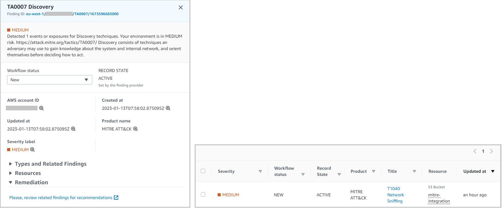

## Integration in Security Hub

Based on the information mapped and registered in the database, one or more techniques correspond to each registered security rule (or event), and at least one tactic. This generates new findings [MITRE ATT&CK](https://attack.mitre.org/matrices/enterprise/cloud/) in Security Hub. 

- **Techniques** findings : contain information about the technique itself, related standards, references to the originating finding and resolution data. 
- **Tactics** findings : are unique per account and region. They contain reference to all underlying active Techniques findings.

### Technique

Information integrated within the type of finding corresponding to a **Technique** of [MITRE ATT&CK](https://attack.mitre.org/matrices/enterprise/cloud/):

- **Title**: reflects the identifier of the technique itself.
- **Severity**: is inherited from the original finding.
- **Description**: contains **general summary information** on the technique used. Additionally a url to access the official site at [MITRE ATT&CK](https://attack.mitre.org/matrices/enterprise/cloud/) with extended information is indicated.
- **Registration status**: will be updated to *ARCHIVED* in case of resolution of the original finding.

- **Related types and results**: refers to the original finding that initiated the process, as well as the types of tactics to which it is related.
- **Resources**: inherits the resources affected in the original finding, allowing related findings to be filtered in SecurityHub.
- Within **Remediation** the information retrieved from the database will be displayed: general implementation and/or remediation recommendations for the rule or event that triggered the original finding. Additionally, it links to the original finding.

Due to limitations in Security Hub not all information can be displayed in the dashboards. Accessing the JSON document of the enriched finding shows all the information provided by the database, including the **list of controls** by security standard that may be being breached by the identified technique.

### Tactics

At all times there shall be at most one **Tactic** of each type, encompassing the underlying **Techniques**:

-   **Title**: reflects the identifier of the tactic itself.
-   **Severity**: is derived from *ACTIVE* techniques for this tactic.
-   **Description**: refers to the severity and number of *ACTIVE* techniques. Includes a url to the [MITRE ATT&CK](https://attack.mitre.org/matrices/enterprise/cloud/) site and general information on the tactic.
- The registration status, due to SecurityHub limitations, becomes *ARCHIVED* under any update (new, closed, updated techniques), generating a new tactic finding.
-   **Related results** and **Resources** lists the 10 latest *ACTIVE* techniques. However, the link in **Correction** filters and displays all *ACTIVE* techniques for this tactic.

