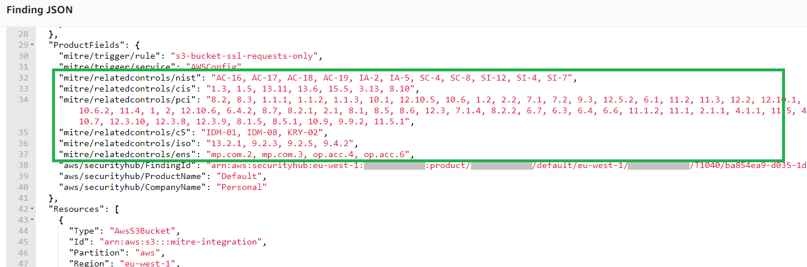

## Integración en Security Hub

En función de la información mapeada y registrada en la base de datos, corresponde una o varias técnicas con cada regla (o evento) de seguridad registrados, y mínimo una táctica. Esto genera nuevos hallazgos [MITRE ATT&CK](https://attack.mitre.org/matrices/enterprise/cloud/) en Security Hub. 

- Los hallazgos de **Técnicas** : contienen información sobre la propia técnica, estándares relacionados, referencias al hallazgo que lo originó y datos de resolución. 
- Los hallazgos de **Tácticas** : son únicos por cuenta y región. Contienen referencia a todos los hallazgos de Técnicas activos subyacentes.

### Técnica

Información integrada dentro del tipo de hallazgo correspondiente a una **Técnica** de [MITRE ATT&CK](https://attack.mitre.org/matrices/enterprise/cloud/):

-   **Título**: refleja el identificador de la propia técnica.
-   **Severidad**: es heredada del hallazgo original.
-   **Descripción**: contiene **información general resumida** de la técnica empleada. Adicionalmente se indica una url para acceder al sitio oficial en [MITRE ATT&CK](https://attack.mitre.org/matrices/enterprise/cloud/) con información extendida.
-   **Estado de registro**: se actualizará a *ARCHIVED* en caso de resolverse el hallazgo original.

-   **Tipos y resultados relacionados**: hacen referencia al hallazgo original que inició el proceso, así cómo a los tipos de tácticas con los que se relaciona.
-   **Recursos**: hereda los recursos afectados en el hallazgo original, permitiendo filtrar en SecurityHub hallazgos relacionados.
-   Dentro de **Corrección** se mostrará la información recuperada de la base de datos: recomendaciones generales de aplicación y/o remediación para la regla o evento que disparó el hallazgo original. Adicionalmente, enlaza con el hallazgo original.

Debido a limitaciones en Security Hub no toda la información podrá mostrarse en los paneles. Accediendo al documento JSON del hallazgo enriquecido se muestra toda la información aportada por la base de datos, incluyendo el **listado de controles** por estandar de seguridad que pueden estar siendo vulnerados por la técnica identificada.

### Táctica

En todo momento deberá existir como máximo una **Táctica** de cada tipo, englobando las **Técnicas** subyacentes:

-   **Título**: refleja el identificador de la propia táctica.
-   **Severidad**: es derivada de técnicas *ACTIVAS* para esta táctica.
-   **Descripción**: hace referencia a la severidad y al número de técnicas *ACTIVAS*. Incluye una url al sitio de [MITRE ATT&CK](https://attack.mitre.org/matrices/enterprise/cloud/) e información general de la táctica.
-   El estado de registro, debido a las limitaciones de SecurityHub, pasa a estar *ARCHIVED* bajo cualquier actualización (técnicas nuevas, cerradas, actualizadas), generando un nuevo hallazgo de táctica.
-   **Resultados relacionados** y **Recursos** recogen las 10 últimas técnicas *ACTIVAS*. No obstante, el enlace en **Corrección** filtra y muestra todas las técnicas *ACTIVAS* para esta táctica.

