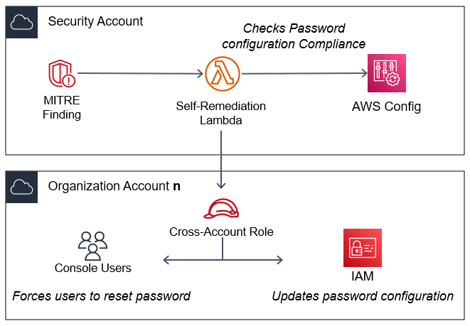
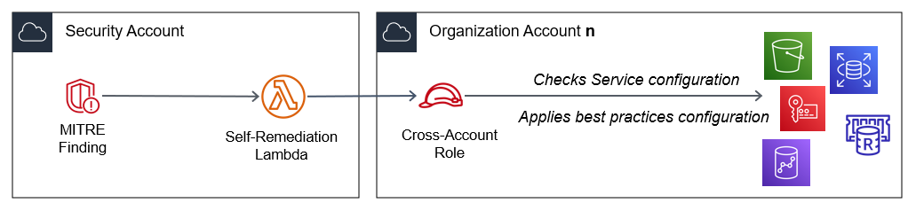
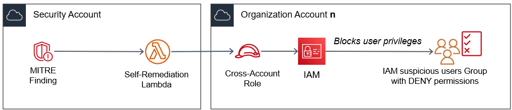

# Self-remediation module

This add-on module adds self-remediation mechanisms for three particular **MITRE ATT&CK findings** generated in Security Hub.

### Case 1

If a finding is generated due tactic *Credential Access (TA0006)* and techniques *Brute Force (T1110)* or *Unsecured Credentials (T1552)*.

Upon detection of activity related to access attempts or unsecured access, automatically password configuration policies will be reviewed in IAM and the best practices configuration will be applied. By default, standards compliance recommended configuration will by applied unless you modify this policy in the **V-SOC, MITER ATT&CK integration project solution in Security Hub** deployment.

Additionally, *console users* will be forced to reset their password at the next login.

### Case 2

If a finding is generated due tactic *Impact (TA0040)* and an exposure is detected to technique *Data Destruction (T1485)*.

Automatically, **options to prevent data loss** will be enabled depending on the trigger service:
-   CloudTrail logs validation
-   AWS KMS key rotation
-   ELB and RDS deletion protection
-   DynamoDB, Elasticache and Redshift backup enabled
-   S3 versioning enabled

### Case 3

If a finding is generated due tactic *Privilege Escalation (TA0004)* and techniques *Domain Policy Modification (T1484)* or *Valid Accounts (T1078)*.

Automatically, upon detection of *suspicious activity* or *non-compliance of the principle of least privilege*, the user will be included in a **group of isolated users** or blocked permissions, pending review.

An email will be sent to the Security Team named in the deployment phase.

## Deployment

This template is compatible for single account environments and for multi-account environments or Organizations. It must first be deployed in the account designated for centralized security services. It can then be deployed to each of the accounts you wish to monitor.

1. Dowload as Zip the lambda's python files from **self-remediation** folder for future use in CloudFormation. Download the CloudFormation template *vsoc-mitreintsh-selfremediation.yml*.

2.  Copy the files **to an S3 bucket accesible from the target account**.

3.  In the console of your AWS account, open the **CloudFormation** service. Click **Create Stack** with new resources.

4.  Enter the URL of the S3 object **vsoc-mitreintsh-selfremediation.yml** in the Amazon S3 URL field under the Specify template section.

5.  Click **Next**. On the next page, enter a name for the stack.

6.  On the same page, assign valid values for the **input parameters** (see below).

7.  Click on **Next**.

8.  Accept all the default options in the screens below. Click on **Next**.

9.  **Check** I confirm that AWS CloudFormation might create IAM resources with custom names and/or I confirm that AWS CloudFormation might require the following capability: CAPABILITY_AUTO_EXPAND. Click **Submit**.

Deployment may take some time.

## Parameters

- The values in the **Ownership** parameters correspond to labels used to identify the deployed resources.
- In **Folders**, you must indicate the name of the S3 bucket (plus folders, if any) where you have saved the templates and zip files for the deployment.
- Under **Organization**, even if it is a single account environment, you must enter the designated account identifier for security services (the one that centralizes the Security Hub findings).
- Under **Credential Access**, **Impact** and **Privilege Escalation**, you will be given the option to enable each of the modules separately.
- In **Privilege Escalation** (module for Privilege Escalation tactics), you will need to provide the following data:
    1. E-mail address for receiving notifications by blocked users (ideally a security administrator reception group).
    2. Title so that notifications received by e-mail are easily identifiable.
    3. Name for the user group in IAM with blocked access.
    4.  **Very important**, specify (comma separated) the name of the privileged IAM users. These users, even if marked as *suspicious*, will still have privileges. This measure **is very important** to prevent the main administrators or the root user from being blocked, leaving the AWS account without administrators with sufficient privileges to make changes.