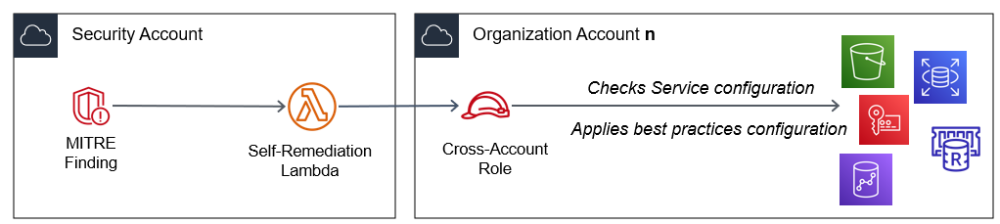
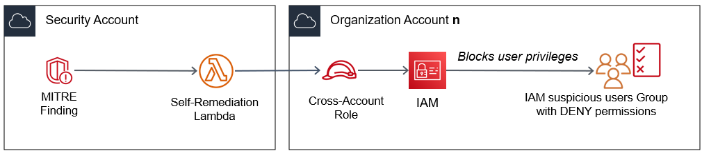

# Módulo de auto-remediación

Este módulo adicional añade mecanismos de auto-remediación para tres casos particulares de hallazgos generados por MITRE ATT&CK en Security Hub.

### Caso 1

Cuando se genera un hallazgo por táctica *Credential Access (TA0006)* y técnicas *Brute Force (T1110)* o *Unsecured Credentials (T1552)*.

Al detectar actividad relacionada con intentos de acceso o uso indebido de credenciales, automáticamente se revisarán las políticas de configuración de contraseñas en IAM y se aplicará la configuración básica mínima. Por defecto, será la configuración básica mínima recomendada por los principales estándares de seguridad. Esta política se puede modificar durante el despliegue de la solución del proyecto de **V-SOC, integración de MITRE ATT&CK en Security Hub**.

Adicionalmente, se obligará los *usuarios de consola* a rotar la contraseña en el siguiente inicio de sesión.

### Caso 2

Cuando se genera un hallazgo por táctica *Impact (TA0040)* y se detecta exposición a técnicas de *Data Destruction (T1485)*.

Automáticamente, revisará y habilitará las **opciones de prevención de pérdida de datos** dependiendo del servicio que inició el evento:
-   Validación de registros en CloudTrail
-   Rotación de claves en AWS KMS
-   Protección de borrado en ELB y RDS
-   Habilitación de *backup* en DynamoDB, Elasticache y Redshift
-   Habilitación de versionado en S3

### Caso 3

Cuando se genera un hallazgo por táctica *Privilege Escalation (TA0004)* y técnicas *Domain Policy Modification (T1484)* o *Valid Accounts (T1078)*.

Automáticamente, tras la detección de esta *actividad sospechosa* o *incumplimiento de aplicar el principio de mínimo privilegio*, el usuario será incluido en un **grupo de usuarios aislados** o de permisos bloqueados, en espera de su revisión.

Un correo será enviado al servicio de seguridad registrado durante el despliegue de la solución.

## Despliegue

Esta plantilla es compatible para entornos de cuenta única y para entornos multi-cuenta u Organizaciones. Deberá desplegarse previamente en la cuenta designada a servicios centralizados de seguridad. A continuación, podrá ser desplegada en cada una de las cuentas que desée supervisar.

1. Descargue como Zip los ficheros python en formato Zip de la carpeta **self-remediation** para su futuro uso en CloudFormation. Descargue la plantilla CloudFormation **vsoc-mitreintsh-selfremediation.yml** de esta carpeta.

2.  Copie los ficheros **a un bucket S3 accesible desde la cuenta de destino**.

3.  En la consola de su cuenta de AWS, abra el servicio **CloudFormation**. Pulse en **Crear pila** con recursos nuevos.

4.  Introduzca la URL del objeto S3 **vsoc-mitreintsh-selfremediation.yml** en el campo URL de Amazon S3 bajo la sección Especificar plantilla.

5.  Pulse en **Siguiente**. En la siguiente página, introduzca un nombre para la pila.

6.  En la misma página, asigne valores válidos para los **parámetros** de entrada (ver más abajo).

7.  Pulse en **Siguiente**.

8.  Acepte todas las opciones por defecto en las pantallas de a continuación. Pulse en **Siguiente**.

9.  **Marque** Confirmo que AWS CloudFormation podría crear recursos de IAM con nombres personalizados y/o Confirmo que AWS CloudFormation podría requerir la siguiente capacidad: CAPABILITY_AUTO_EXPAND. Pulse **Enviar**.

El despliegue puede llevar algún tiempo.

## Parámetros

-   Los valores en los parámetros de **Ownership** (Propiedad) corresponden a etiquetas que sirven para identificar los recursos desplegados.
-   En **Folders** (Carpetas), deberá indicar el nombre del bucket S3 (más carpetas, de existir) en dónde haya guardado las plantillas y ficheros zip para el despliegue.
-   Dentro de **Organization** (Organización), aún siendo un entorno de cuenta única, deberá introducir el identificador de cuenta designada para servicios de seguridad (aquella que centralice los hallazgos de Security Hub).
-   En **Credential Access**, **Impact** y **Privilege Escalation**, se le dará la opción de habilitar cada uno de los módulos por separado.
-   En **Privilege Escalation** (módulo para tácticas de Escalado de Privilegios), deberá proveer los siguientes datos:
    1.  Dirección de correo electrónico para la recepción de notificaciones por usuarios bloqueados (idealmente grupo de administración de seguridad).
    2.  Título para que las notificaciones recibidas por correo electrónico sean fácilmente identificables.
    3.  Nombre para el grupo de usuarios en IAM con acceso bloqueado.
    4.  **Muy importante**, especificar (separando por coma) el nombre de los usuarios de IAM privilegiados. Estos usuarios, aún siendo marcados como *sospechosos* seguirán gozando de privilegios. Esta medida **es muy importante** para evitar que administradores principales o el usuario raíz queden bloqueados, dejando a la cuenta de AWS sin administradores con privilegios suficientes para realizar cambios.